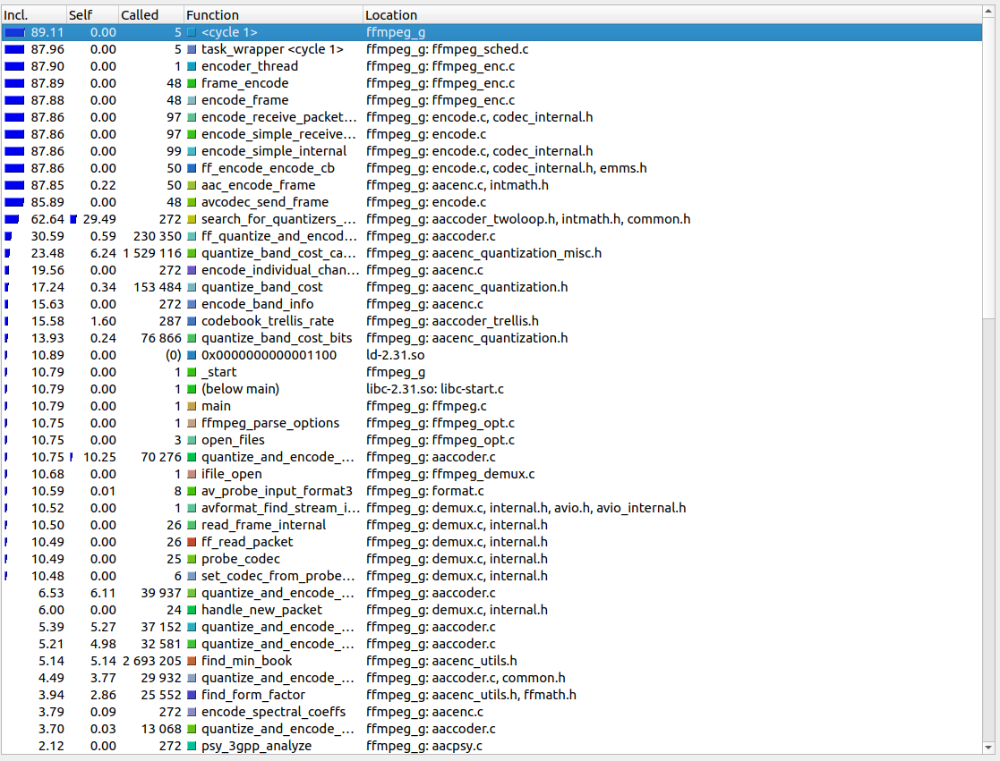
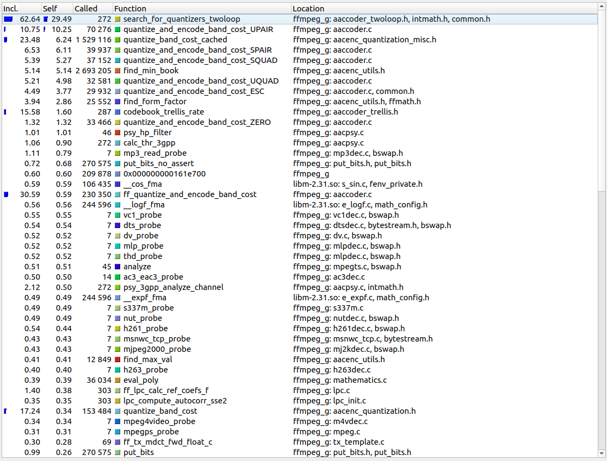

# Atividade Final de Arquitetura e Organização de Computadores

## Sumário

* [Integrantes do Grupo](#integrantes-do-grupo)
* [Sobre o FFmpeg](#sobre-o-ffmpeg)
* [Escopo do Projeto](#escopo-do-projeto)
* [Ferramentas utilizadas](#ferramentas-utilizadas)
* [Compilando o FFmpeg](#compilando-o-ffmpeg)
* [Download da ferramenta perf e do valgrind](#download-da-ferramenta-perf-e-do-valgrind)
* [Fazendo o profiling do FFmpeg em seu estado original](#fazendo-o-profiling-do-ffmpeg-em-seu-estado-original)
  - [perf stat -o](#perf-stat--o)
  - [Profiling mais detalhado com o perf](#profiling-mais-detalhado-com-o-perf)
  - [Profiling com valgrind](#profiling-com-valgrind)
* [Tentativas de Otimização](#tentativas-de-otimização)
  - [Zerando registradores](#zerando-registradores)
  - [Loop Unrolling e Common Subexpression Elimination](#loop-unrolling-e-common-subexpression-elimination)
    - [CSE](#cse)
    - [Loop Unrolling](#loop-unrolling)
    - [Resultados (Loop Unrolling & CSE)](#resultados-loop-unrolling--cse)
* [Melhor otimização encontrada](#melhor-otimização-encontrada)

## Integrantes do grupo

Gabriel Silva Ferreira - RA: 123123456 <br>
Thiago Inouye Miyazaki - RA: 123456789

## Sobre o FFmpeg
Para o nosso projeto escolhemos tentar otimizar um aplicativo/biblioteca chamado FFmpeg, que é composto de um conjunto de vários outros aplicativos e bibliotecas utilizadas na manipulação e conversão de arquivos de áudio e vídeo.<br>

O FFmpeg é amplamente utilizado no meio audiovisual para fazer transcoding, edições básicas, scaling, pós-produção, conversão e padronização de áudio e vídeo, sendo conhecido pela sua alta performance, vasta quantidade de codecs suportados e desempenho veloz, e suas funcionalidades são empregadas em aplicativos como VLC e Youtube.<br>

Além disso, o FFmpeg é um aplicativo gratuito e open-source.

## Escopo do projeto
O FFmpeg é um aplicativo muito grande e complexo, sendo que decidimos nos concentrar em tentar otimizar alguma função que faz parte do processo de conversão de áudio para o formato .aac. Os testes de desempenho foram feitos sob o cenário em que o usuário deseja fazer a conversão de um arquivo .wav (WAVE) para aac.<br>

O WAVE é um formato lossless e sem compressão, enquanto o AAC (Advanced Audio Coding) é um formato lossy e com compressão, que, embora tenha sido menos utilizado hoje em dia, foi muito importante e amplamente utilizados em diversas plataformas como iPhone, iPod, iPad, Nintendo DSi, Nintendo 3DS, Apple Music, iTunes, DivX Plus Web Player, PlayStation 4 e frequentemente como o formato de áudio do codec de vídeo H264. Dado um mesmo valor de bit rate, o AAC é conhecido por fornecer uma maior qualidade de áudio em comparação ao MP3.

## Ferramentas utilizadas

Para fazer o **profiling** utilizamos duas ferramentas: o **Valgrind**, em especial a ferramenta **callgrind**, e o **perf**.

## Compilando o FFmpeg

- Baixe o source code ou clone o repositório em https://github.com/FFmpeg/FFmpeg

- Execute os seguintes comandos:

```bash
$ cd path/to/source/code/root/folder

# configura o ambiente
$ ./configure --disable-optimizations --enable-debug=3 --enable-linux-perf

# --disable-optimizations : desabilita otimizações do compilador
# --enable-debug=3 : fornece mais infos. para debugging
# --enable-linux-perf : habilita profiling (Monitor API)

# compila usando apenas dois núcleos (paradoxalmente mais rápido)
$ make -j2
```

- Sem estas flags o debugging fica comprometido pois não é possível enxergar o nome das funções que estão sendo executadas, perdendo a utilidade do debugging.

## Download da ferramenta perf e do valgrind

- Faça o download da ferramenta `valgrind` e do `perf` através do repositório da sua distribuição. Os pacotes e bibliotecas podem variar de acordo com a distribuição e a própria versão do kernel da distribuição. Ela será utilizada para fazer o **profiling** de **tempo de execução do programa**.

```bash
# o penúltimo pacote precisa ser baixado com a versão correta do kernel
$ sudo apt install linux-tools-common linux-tools-generic linux-tools-$(uname -r) valgrind
```

## Fazendo o profiling do FFmpeg em seu estado original
## perf stat -o

- Para fazer um profiling mais rápido e generalista:

```bash
$ sudo perf stat -o tweaked_perf.txt -- ./ffmpeg_g -i arquivos/OAF_back_happy.wav -c:a aac -b:a 192k arquivos/output.aac
```

- Ao rodar o `perf stat -o` geramos um arquivo como este:

```
# started on Mon Jul  8 20:44:55 2024


 Performance counter stats for './ffmpeg_g -i arquivos/OAF_back_happy.wav -c:a aac -b:a 192k arquivos/output.aac':

            129,06 msec task-clock                #    1,015 CPUs utilized          
               151      context-switches          #    1,170 K/sec                  
                15      cpu-migrations            #  116,224 /sec                   
             1.088      page-faults               #    8,430 K/sec                  
       557.024.381      cycles                    #    4,316 GHz                    
     1.542.312.588      instructions              #    2,77  insn per cycle         
       133.136.305      branches                  #    1,032 G/sec                  
         1.333.435      branch-misses             #    1,00% of all branches        
     2.749.563.850      slots                     #   21,304 G/sec                  
     1.546.523.722      topdown-retiring          #     56,1% retiring              
       287.984.603      topdown-bad-spec          #     10,4% bad speculation       
       192.997.631      topdown-fe-bound          #      7,0% frontend bound        
       731.352.157      topdown-be-bound          #     26,5% backend bound         

       0,127164454 seconds time elapsed

       0,124269000 seconds user
       0,008284000 seconds sys
```

- Para compararmos os tempos de execução e chegarmos à conclusão acerca de **melhorias no desempenho**, neste projeto levaremos em consideração principalmente a **quantidade de ciclos** de uma execução, comparando a quantidade de ciclos das diferentes execuções realizadas.
- Note que nesta execução, o programa levou **557.024.381 ciclos**.

## Profiling mais detalhado com o perf

- Para obter um profiling mais detalhado com o `perf`:
```bash
$ sudo perf record ./ffmpeg_g -i arquivos/OAF_back_happy.wav -c:a aac -b:a 192k arquivos/output.aac
$ sudo perf report > report_vanilla_example.txt
```

- O segundo comando irá redirecionar o output para o arquivo designado, cujo conteúdo será similar a este:

```bash
$ cat report_vanilla_example.txt 
"
# To display the perf.data header info, please use --header/--header-only options.
#
#
# Total Lost Samples: 0
#
# Samples: 625  of event 'cycles'
# Event count (approx.): 590885397
#
# Overhead  Command          Shared Object       Symbol                                 
# ........  ...............  ..................  .......................................
#
    19.35%  enc0:0:aac       ffmpeg_g            [.] search_for_quantizers_twoloop
     7.56%  enc0:0:aac       ffmpeg_g            [.] quantize_and_encode_band_cost_UPAIR
     6.43%  enc0:0:aac       ffmpeg_g            [.] find_min_book
     6.30%  enc0:0:aac       ffmpeg_g            [.] quantize_and_encode_band_cost_SPAIR
     5.55%  enc0:0:aac       ffmpeg_g            [.] quantize_and_encode_band_cost_SQUAD
     4.89%  enc0:0:aac       ffmpeg_g            [.] quantize_and_encode_band_cost_UQUAD
     4.83%  enc0:0:aac       ffmpeg_g            [.] find_form_factor
     4.75%  enc0:0:aac       ffmpeg_g            [.] quantize_band_cost_cached
     3.40%  enc0:0:aac       ffmpeg_g            [.] quantize_and_encode_band_cost_ESC
     1.40%  enc0:0:aac       libm-2.31.so        [.] __cos_fma
     1.33%  ffmpeg_g         ffmpeg_g            [.] mlp_probe
     1.26%  enc0:0:aac       ffmpeg_g            [.] ff_quantize_and_encode_band_cost
     1.06%  ffmpeg_g         ffmpeg_g            [.] amrnb_probe
     1.05%  ffmpeg_g         libc-2.31.so        [.] __strcmp_avx2
     1.04%  ffmpeg_g         ffmpeg_g            [.] avpriv_find_start_code
     1.03%  mux0:adts        [kernel.kallsyms]   [k] dequeue_task_fair
     0.96%  enc0:0:aac       ffmpeg_g            [.] ff_tx_mdct_fwd_float_c
     0.95%  dec0:0:pcm_s16l  ffmpeg_g            [.] packet_decode
    ...
"
```
- Note que as duas funções que levaram mais tempo são `search_for_quantizers_twoloop` e `quantize_and_encode_band_cost_UPAIR`.
- **Vamos começar a nossa investigação com estas duas funções.**


## Profiling com valgrind

- A primeira ferramenta que tentamos usar, na verdade, foi a ferramenta **Callgrind** do **Valgrind**
- É uma ferramenta bastante interessante e que fornece riqueza de informações, mas apresenta mais informações do que desejamos, e para questões de parsing de execuções em massa, o `perf` mostrou-se mais prático.
- Contudo achamos válido comentar sobre a ferramenta, e além disso, ela serviu para cruzarmos as informações obtidas pelo `perf`, facilitando a interpretação dos resultados.

```bash
# para fazer o profiling com o valgrind executamos
$ valgrind --tool==callgrind ./ffmpeg_78g -i arquivos/OAF_back_happy.wav -c:a aac -b:a 192k arquivos/output.aac
```

- A execução do comando acima vai gerar um arquivo chamado `callgrind.out.<pid>`, onde <pid> é o número do processo gerado pelo programa.
- Este arquivo pode ser acessado e interpretado **via CLI**:

```bash
$ callgrind_annotate callgrind.out.82686 --inclusive=yes --tree=both
--------------------------------------------------------------------------------
Profile data file 'callgrind.out.82686' (creator: callgrind-3.15.0)
--------------------------------------------------------------------------------
I1 cache: 
D1 cache: 
LL cache: 
Timerange: Basic block 0 - 135777101
Trigger: Program termination
Profiled target:  ./ffmpeg_g -i arquivos/OAF_back_happy.wav -c:a aac -b:a 192k arquivos/output.aac (PID 82686, part 1)
Events recorded:  Ir
Events shown:     Ir
Event sort order: Ir
Thresholds:       99
Include dirs:     
User annotated:   
Auto-annotation:  off

--------------------------------------------------------------------------------
Ir            
--------------------------------------------------------------------------------
1,534,851,417  PROGRAM TOTALS

--------------------------------------------------------------------------------
Ir             file:function
--------------------------------------------------------------------------------

1,367,726,700  < /build/glibc-LcI20x/glibc-2.31/misc/../sysdeps/unix/sysv/linux/x86_64/clone.S:clone (20x) [/usr/lib/x86_64-linux-gnu/libc-2.31.so]
1,367,726,700  *  /build/glibc-LcI20x/glibc-2.31/nptl/pthread_create.c:start_thread [/usr/lib/x86_64-linux-gnu/libpthread-2.31.so]
1,367,661,653  >   /home/thiagomi/Documents/Arquitetura/new/FFmpeg-master/fftools/ffmpeg_sched.c:task_wrapper (5x)
       50,920  >   ???:0x0000000004b0e840 (20x) [???]
        6,645  >   /home/thiagomi/Documents/Arquitetura/new/FFmpeg-master/libavutil/slicethread.c:thread_worker (15x)
        1,699  >   ???:0x0000000004b0e7d0 (20x) [???]
        1,400  >   ???:0x0000000004b0e950 (20x) [???]
        1,374  >   ???:0x0000000004b0e7b0 (20x) [???]

1,367,661,653  < /build/glibc-LcI20x/glibc-2.31/nptl/pthread_create.c:start_thread (5x) [/usr/lib/x86_64-linux-gnu/libpthread-2.31.so]
1,367,661,653  *  /home/thiagomi/Documents/Arquitetura/new/FFmpeg-master/fftools/ffmpeg_sched.c:task_wrapper
...
```
- Note que os números mostrados acima não indicam ciclos, mas instruções removidas.
- Mas também pode ser visualizado via interface gráfica, usando o programa `kcachegrind`:

```
$ sudo apt update
$ sudo apt install kcachegrind
$ kcachegrind callgrind.out.82686
```



- O interessante é que esta visualização nos dá uma noção da quantidade de tempo gasta em cada função, mas nos dá a capacidade de discernir a diferença entre a quantidade de tempo que uma função gasta porque ela **chama outras funções**, e a quantidade de tempo que uma função gasta **executando suas próprias instruções**.
- Esta distinção é importante, porque como podemos ver na imagem acima, embora funções como `encoder_thread` e `frame_encode` apareçam com valores altos, na verdade muito do processamento é gasto em outras funções que são chamadas por elas. Logo, é interessante nos concentrarmos na coluna `self` da tabela mostrada pelo `kcachegrind`.
- Podemos alterar a ordem de exibição dos itens na tabela e teremos o seguinte:



- E assim como nos resultados mostrados pelo `perf`, notamos que as duas funções de maior *overhead* são `search_for_quantizers_twoloop` e `quantize_and_encode_band_cost_UPAIR`.

# Tentativas de Otimização

Tentamos uma série de abordagens para a melhoria do desemepenho do programa que se mostraram frustradas ou pouco eficientes, vamos listar algumas delas e falar sobre aquela que foi mais bem sucedida na diminuição da quantidade de ciclos utilizados na execução do programa.

## Zerando registradores

Um artigo chamada "The Surprising Subtleties of Zeroing a Register" nos deu a ideia de tentarmos zerar os registradores de um modo diferente (https://randomascii.wordpress.com/2012/12/29/the-surprising-subtleties-of-zeroing-a-register/).

Ao gerarmos o código em x86-64 AT&T Assembly do módulo `aaccoder.c`:
```bash
$ make libavcodec/aaccoder.s
CC	libavcodec/aaccoder.s
```

Notamos a existência de instruções como:

```asm
movl	$0, %edi
movl	$0, %eax
```

Segundo o artigo, existe a possibilidade de ganharmos desempenho zerando os registradores utilizando a expressão `xor %reg, %reg`. Contudo, o ganho de desempenho pode variar em diferentes processadores, sendo especialmente menor em 64 bits.

Notamos a presença de 24 destas instruções como essas no arquivo `aaccoder.s`, que foram alteradas via expressão regular. <br>

O arquivo foi recompilado via: 
```bash
# compilando
$ gcc -c -g -o libavcodec/aaccoder.o libavcodec/aaccoder_mod_2.s

# montando o executável novamente:
$ make
AR	libavcodec/libavcodec.a
LD	ffmpeg_g
STRIP	ffmpeg
LD	ffprobe_g
STRIP	ffprobe
```

Foi feito novamente o profiling sobre o novo executável, **mas nenhuma melhoria notável foi percebida**.

```bash
$ cat zeroing_perf.txt 
# started on Mon Jul  8 22:28:04 2024


 Performance counter stats for './ffmpeg_g -i arquivos/OAF_back_happy.wav -c:a aac -b:a 192k arquivos/output.aac':

            124,98 msec task-clock                #    1,011 CPUs utilized          
               146      context-switches          #    1,168 K/sec                  
                12      cpu-migrations            #   96,013 /sec                   
             1.085      page-faults               #    8,681 K/sec                  
       557.858.996      cycles                    #    4,463 GHz                    
     1.542.301.284      instructions              #    2,76  insn per cycle         
       133.132.887      branches                  #    1,065 G/sec                  
         1.512.492      branch-misses             #    1,14% of all branches        
     2.777.320.405      slots                     #   22,222 G/sec                  
     1.561.094.624      topdown-retiring          #     56,0% retiring              
       273.184.641      topdown-bad-spec          #      9,8% bad speculation       
       204.823.054      topdown-fe-bound          #      7,4% frontend bound        
       746.654.951      topdown-be-bound          #     26,8% backend bound         

       0,123608893 seconds time elapsed

       0,125538000 seconds user
       0,004184000 seconds sys

```

## Loop Unrolling e Common Subexpression Elimination

O **Loop Unrolling** visa reduzir a quantidade de loops, assim reduzindo a quantidade de *branchings* e de possíveis *branch penalties*. É uma técnica que pode ser muito eficiente se utilizada da forma correta. É uma técnica que troca a complexidade de espaço pela complexidade, visto que o código torna-se maior e mais "verboso", porém com desempenho mais otimizado.

O **Common Subexpression Elimination** é uma técnica que visa eliminar cálculos redundantes, reutilizando valores já calculados ou valores que já foram trazidos da memória, por exemplo, para que acessos desnecessários à memória não sejam feitos.

Embora as duas técnicas sejam extremamente poderosas quando **bem empregadas** dentro do escopo do trabalho e do tempo fornecido não fomos capazes de executar grandes otimizações com estas técnicas. Um dos motivos principais é a complexidade do código do FFmpeg, que lida com cálculos complexos e funções de tamanho gigantesco para efeutar os cálculos - tornando muito difícil localizar as dependências, o que por sua vez torna difícil fazer modificações sem quebrar o código.

Tentamos duas abordagens:

### CSE

* Na aplicação do **CSE** notamos que em loops é comum que o código faça repetidos acessos às mesmas posições de memória:

```asm
.LBB415:
	.loc 12 105 26
	movl	$0, -156(%rbp)
	.loc 12 105 17
	jmp	.L537
.L538:
	.loc 12 106 26
	movl	-160(%rbp), %edx
	movl	-156(%rbp), %eax
	addl	%edx, %eax
	cltq
	.loc 12 106 24
	leaq	0(,%rax,4), %rdx
	movq	-48(%rbp), %rax
	addq	%rdx, %rax
	.loc 12 106 30
	pxor	%xmm0, %xmm0
	movss	%xmm0, (%rax)
	.loc 12 105 43
	addl	$1, -156(%rbp)
.L537:
	.loc 12 105 17
	movl	-172(%rbp), %eax
	cmpl	-156(%rbp), %eax
	jg	.L538
```
- Tentamos mover estas posições para o registrador. Contudo, chegamos à conclusão de que não seria de muita utilidade, visto que, provavelmente, estes valores já seriam levados à memória cache, devido à **localidade temporal**.

### Loop Unrolling

* Notamos que a expressão `rep stosq` era utilizada algumas vezes no código, que é uma instrução onde:
  - Para `ecx` repetição, guarda o conteúdo de `eax` no espaço para onde `edi` aponta, incrementando/decrementado `edi` posições a cada escrita.
  - Ou seja, faz repetidos acessos à posições relativamente contíguas na memória.

* Então, em alguns trechos trocamos:
```asm
rep stosq

# por:

(...)
.loop_unroll_start:     # levando-se em consideração incrementos de 8 em 8
movq %rax, (%rdi)
movq %rax, 8(%rdi)
movq %rax, 16(%rdi)
movq %rax, 24(%rdi)
movq %rax, 32(%rdi)
movq %rax, 40(%rdi)
movq %rax, 48(%rdi)
movq %rax, 56(%rdi)
(...)
jnz .loop_unroll_start
(...)
```

### Resultados (Loop Unrolling & CSE)

Por fim, estas duas otimizações não se mostraram tão eficazes. Contudo, é preciso ressaltar a ressalva que fizemos, esta é uma otimização que, dentro do contexto correto e quando devidamente empregada, dá bons resultados, mas devido à complexidadade do FFmpeg e por restrições de tempo, não fomos capazes de realizá-la satisfatoriamente. Obtivemos apenas uma pequena melhoria:

```bash
$ cat loopunrolling_perf.txt 
# started on Mon Jul  8 22:36:54 2024


 Performance counter stats for './ffmpeg_g -i arquivos/OAF_back_happy.wav -c:a aac -b:a 192k arquivos/output.aac':

            133,23 msec task-clock                #    1,010 CPUs utilized          
               172      context-switches          #    1,291 K/sec                  
                12      cpu-migrations            #   90,068 /sec                   
             1.090      page-faults               #    8,181 K/sec                  
       550.938.254      cycles                    #    4,135 GHz                    
     1.542.803.428      instructions              #    2,80  insn per cycle         
       133.212.004      branches                  #  999,841 M/sec                  
         1.320.182      branch-misses             #    0,99% of all branches        
     2.735.361.020      slots                     #   20,531 G/sec                  
     1.528.557.842      topdown-retiring          #     55,2% retiring              
       339.878.638      topdown-bad-spec          #     12,3% bad speculation       
       194.394.136      topdown-fe-bound          #      7,0% frontend bound        
       706.825.135      topdown-be-bound          #     25,5% backend bound         

       0,131855763 seconds time elapsed

       0,133634000 seconds user
       0,004049000 seconds sys
```

# Melhor otimização encontrada

A melhor otimização que conseguimos fazer foi na função `quantize_and_encode_band_cost_template`, que é instanciada diversas vezes como `quantize_and_encode_band_cost_SPAIR`, `quantize_and_encode_band_cost_SQUAD`, `quantize_and_encode_band_cost_UQUAD` e `quantize_and_encode_band_cost_ESC` e em outras funções que utilizam a **multiplicação por inteiros**.

Através de uma função que utiliza *assembly inline* para efetuar a **multiplicação por inteiros não negativos**:

```c
int multiply(int a, int b) {
    int result;
    __asm__ volatile (
        "movl %1, %%eax;"      // Carrega a para EAX
        "movl %2, %%ebx;"      // Carrega b para EBX
        "xorl %%ecx, %%ecx;"   // Zera ECX
        "xorl %%edx, %%edx;"   // Zera EDX

        "movl $1, %%edx;"      // Define o bit mask para 1

        "1:;"
        "testl %%ebx, %%edx;"  // Testa o bit em EBX usando EDX
        "jz 2f;"               // Se não, pular par ao label 2

        "addl %%eax, %%ecx;"   // Adiciona EAX para ECX (acumulando)

        "2:;"
        "shll $1, %%eax;"      // Shift left em 1 (multiplicando por 2)
        "shll $1, %%edx;"      // Shift left em 1 (move o bit da mask)
        "testl %%ebx, %%edx;"  // Verifica se há mais bits para processar
        "jnz 1b;"              // Caso haja, ir para o label 1

        "movl %%ecx, %0;"      // Guardar o resultado em result
        : "=r" (result)
        : "r" (a), "r" (b)
        : "%eax", "%ebx", "%ecx", "%edx"
    );
    return result;
}
```

Como a função apenas funciona para o cálculo de inteiro não-negativos, vamos utilizar apenas para calcular índices, em linhas de código como:

```C
vec     = &ff_aac_codebook_vectors[cb-1][curidx*dim];
if (ff_aac_codebook_vectors[cb-1][curidx*dim+j] != 0.0f)
curidx *= aac_cb_range[cb];
```

- Note que nestas linhas de código a multiplicação é utilizada para o cálculo de índices, o que não envolve números negativos.

- Então, onde multiplicações como estas eram feitas, trocamos a multiplicação pela função `multiply()`:
```C
curidx = multiply(aac_cb_range[cb], curidx);
```
* São multiplicações presentes dentro de **nested loops**. Como são funções que trabalham sobre frames/windows/samples de arquivos de áudio, devem ser processadas para cada unidade de amostragem, logo são funções que podem são chamadas milhares de vezes, mesmo para arquivos de áudio pequenos.
  - Ou seja, são funções críticas para o desempenho do programa.
  - Para corroborar com esta análise, o profiling demonstrou que grande parte do processamento é gasto nestas funções.

* Para implementar as mudanças, foi modificado o arquivo `aaccoder.c` em todas as multiplicações por inteiro possíveis, e o programa foi recompilado e montado:

```
$ rm ffmpeg_g
$ rm libavcodec/aaccoder.o
$ make
CC	libavcodec/aaccoder.o
AR	libavcodec/libavcodec.a
LD	ffmpeg_g
STRIP	ffmpeg
LD	ffprobe_g
STRIP	ffprobe

$ sudo perf stat -o multiply_mod_perf.txt -- ./ffmpeg_g -i arquivos/OAF_back_happy.wav -c:a aac -b:a 192k arquivos/output.aac

$ cat multiply_mod_perf.txt 
# started on Mon Jul  8 23:38:07 2024


 Performance counter stats for './ffmpeg_g -i arquivos/OAF_back_happy.wav -c:a aac -b:a 192k arquivos/output.aac':

             94,39 msec task-clock                #    1,018 CPUs utilized          
               145      context-switches          #    1,536 K/sec                  
                17      cpu-migrations            #  180,096 /sec                   
             1.089      page-faults               #   11,537 K/sec                  
       426.399.936      cycles                    #    4,517 GHz                    
     1.296.537.239      instructions              #    3,04  insn per cycle         
       129.463.919      branches                  #    1,372 G/sec                  
           951.641      branch-misses             #    0,74% of all branches        
     2.093.741.035      slots                     #   22,181 G/sec                  
     1.303.525.939      topdown-retiring          #     61,7% retiring              
       193.242.851      topdown-bad-spec          #      9,1% bad speculation       
       174.940.562      topdown-fe-bound          #      8,3% frontend bound        
       441.357.570      topdown-be-bound          #     20,9% backend bound         

       0,092686380 seconds time elapsed

       0,093741000 seconds user
       0,004260000 seconds sys
```

* Fazendo o profile com informações mais detalhadas:
```bash
$ sudo perf report > multiply_mod_detailed_perf.txt
$ cat multiply_mod_detailed_perf.txt 
# To display the perf.data header info, please use --header/--header-only options.
#
#
# Total Lost Samples: 0
#
# Samples: 534  of event 'cycles'
# Event count (approx.): 448058043
#
# Overhead  Command          Shared Object       Symbol                                 
# ........  ...............  ..................  .......................................
#
    22.86%  enc0:0:aac       ffmpeg_g            [.] search_for_quantizers_twoloop
    10.97%  enc0:0:aac       ffmpeg_g            [.] quantize_and_encode_band_cost_ESC
     6.72%  enc0:0:aac       ffmpeg_g            [.] multiply
     6.28%  enc0:0:aac       ffmpeg_g            [.] quantize_and_encode_band_cost_UPAIR
     5.99%  enc0:0:aac       ffmpeg_g            [.] quantize_band_cost_cached
     4.75%  enc0:0:aac       ffmpeg_g            [.] find_min_book
     3.14%  enc0:0:aac       ffmpeg_g            [.] quantize_and_encode_band_cost_SPAIR
     2.17%  enc0:0:aac       ffmpeg_g            [.] quantize_and_encode_band_cost_UQUAD
     1.52%  ffmpeg_g         ffmpeg_g            [.] thd_probe
     1.49%  mux0:adts        ffmpeg_g            [.] put_bits_no_assert
     1.46%  enc0:0:aac       ffmpeg_g            [.] quantize_and_encode_band_cost_SQUAD
     1.39%  ffmpeg_g         ffmpeg_g            [.] ac3_eac3_probe
     1.34%  ffmpeg_g         ffmpeg_g            [.] str2id
```

* Notamos a aparição da função que criamos, `multiply()`, indicando que está sendo utilizada muitas vezes. Contudo, percebe-se um decréscimo notável na quantidade de ciclos por execução. Dando fortes indícios de que esta otimização possui resultados mais relevantes que as anteriores.


```bash
Vanilla Run (sem otimização):
    557.024.381      cycles

Tweaked Run (com otimização na multiplicação por inteiros não-negativos):
    426.399.936      cycles
```

* Em seguida, precisamos fazer testes em massa para confirmar que, de fato, a otimização trouxe resultados concretos e estatisticamente confiáveis.
